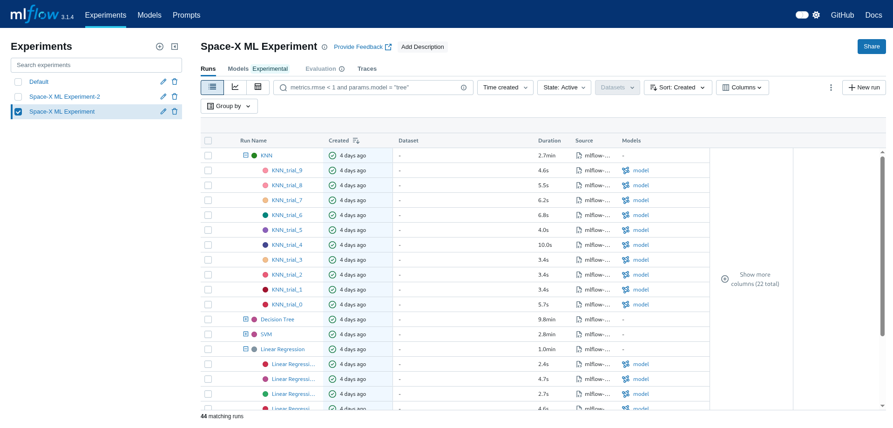

    
    
    

# Winning Space Race with Data Science
## IBM Data Science Professional Certificate Capstone Project
> Author: Duguma Y. (panderior)

> This is a repository of my submission for the [IBM Data Science Professional Certificate](https://www.coursera.org/professional-certificates/ibm-data-science) Course 10 Capstone project. It's a project on getting insight about the landing outcomes of Space-X boosters.
> It includes the whole process of obtaining and wrangling data, performing EDA, getting location and map based insights, training a Machine Learning model and developing a dashboard for interactive experiance with the data.

    <a href="https://www.coursera.org/professional-certificates/ibm-data-science">Specialization Course</a> &nbsp; | &nbsp;
    <a href="https://github.com/panderior/IBM-DS-Capstone-proj/blob/main/report/ds-capstone-report-coursera.pdf">Report</a> &nbsp; | &nbsp;
    <a href="https://www.coursera.org/account/accomplishments/professional-cert/X3QNM59QZ3LJ">Certificate</a>

---
## Tech Stack built with
The technology / frameworks / tools used in this project are:
- [Python](https://www.python.org/downloads/)
- [Dash Plotly](https://dash.plotly.com/)
- [Docker](https://www.docker.com/)
- [Jupyter Notebook](https://jupyter.org/)
- [MLFlow](https://mlflow.org/)
- [Folium](https://python-visualization.github.io/folium/latest/)
- [Scikit-learn](https://scikit-learn.org/stable/)
- [Matplotlib](https://matplotlib.org/)
- [Seaborn](https://seaborn.pydata.org/)
- [Pandas](https://pandas.pydata.org/)
- [BeautifulSoup](https://pypi.org/project/beautifulsoup4/)

---
## Notebooks
The purpose of the notebooks located under the notebooks directory is specified below:
- [edadataviz](./notebooks/edadataviz.ipynb): is a notebook for EDA and visualization of the datasets.
- [jupyter-labs-eda-sql-coursera_sqllite](./notebooks/jupyter-labs-eda-sql-coursera_sqllite.ipynb): is a notebook that obtains various insights from the input datasets using SQL.
- [jupyter-labs-spacex-data-collection-api](./notebooks/jupyter-labs-spacex-data-collection-api.ipynb): is a notebook that gathers and obtains the input datasets by calling an API from Space-X.
- [jupyter-labs-webscraping](./notebooks/jupyter-labs-webscraping.ipynb): is a notebook that gathers and obtains the input datasets by performing scrapping on Wikipidea article related to Space-X launches. 
- [lab_jupyter_launch_site_location](./notebooks/lab_jupyter_launch_site_location.ipynb): is a notebook which extractes location and map based insight from the datasets.
- [labs-jupyter-spacex-Data wrangling](./notebooks/labs-jupyter-spacex-Data%20wrangling.ipynb): is a notebook to perform data wrangling and transformaiton.
- [SpaceX_Machine Learning Prediction](./notebooks/SpaceX_Machine%20Learning%20Prediction.ipynb): is a notebook that trains and compared Machine Learning models for the prediction of landing outcomes of the Space-X boosters.

---
## Plotly Dashboard
### Method 1: using Docker
1. In the parent project directory run the docker-compose command to create an image and run it.
    - `docker compose up -d`
2. Access the dashboard on the host ip address and port. If no changes are made, the default port is 8050.

### Method 2: running python script
As an alternative, users can run the Dash plotly script directly. However, in this case users will be responsible in installing all the required libraries and setting up a suitable enviroment.
1. Create a virtual enviroment of choice and activate it.
2. Install the required libraries from the [requirements.txt](./requirements.txt) file.
    - `pip install -r requirements.txt`
3. Run the plotly dashboard script.
    - `python spacex-dash-app.py`
4. Access the dashboard on the host ip address and port. If no changes are made, the default port is 8050.

---
## MLFlow
MLFlow can be used to run and log multiple runs of the ML models. Thereafter a python script can be used to connect to MLFlow API to the best inidividual and aggregate model results based on metrics.
1. Create a virtual enviroment of choice and activate it.
2. Install the required libraries from the [requirements.txt](./requirements.txt) file.
    - `pip install -r requirements.txt`
3. First run the MLFLow server on a terminal.
    - `mlflow server --host 127.0.0.1 --port 8080`
4. Then on another terminal run the MLFlow trainer and logger script ([mlflow_train_script.py](./mlflow_train_script.py)). Provide an experiment name to log the ML models results to.
    - `python mlflow_train_script.py  --exp_name "Space-X ML Experiment"`
3. Finally the best individual and aggregate ML models results can be viewed by running the results python script ([mlflow_result_script.py](./mlflow_result_script.py)). Provide the experiment name to get the results from and the metrics to compare on (default is `test_accuracy`).
    - `python mlflow_result_script.py  --exp_name "Space-X ML Experiment" --metric test_accuracy`

---
## License
This opensource project is licensed under Apache 2.0 license. For more details please refer to the [LICENSE](./LICENSE.md)
file.