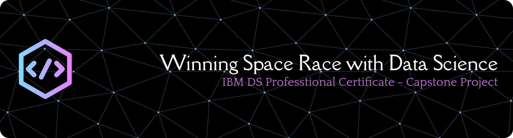

    
    
    

# Winning Space Race with Data Science
## IBM Data Science Professional Certificate Capstone Project
> Author: Duguma Y. (panderior)

> This is a repository of my submission for the [IBM Data Science Professional Certificate](https://www.coursera.org/professional-certificates/ibm-data-science) Course 10 Capstone project.
>

## MLFlow
- running the mlflow server
    `mlflow server --host 127.0.0.1 --port 8080`